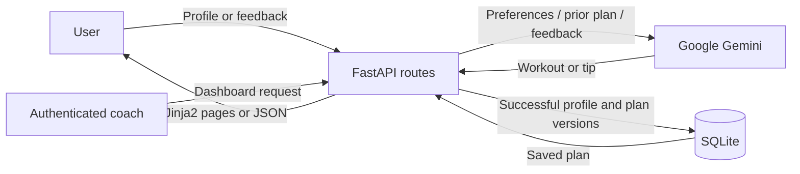

# 2. Requirement Analysis

## Solution requirements
| ID | Requirement | Acceptance criterion |
| --- | --- | --- |
| FR1 | Capture name, age, weight, goal and intensity | Valid profile is accepted; blank names, invalid ranges and unsupported choices return 422 |
| FR2 | Generate seven-day plan | AI prompt asks for DAY 1–7, warm-up, exercises, sets/reps, rest, cooldown and recovery |
| FR3 | Persist profiles and generated plans | Successful generation saves one user and original plan in SQLite |
| FR4 | Update plan from feedback | Revision uses prior plan and profile; original remains unchanged |
| FR5 | Generate nutrition/recovery tip | Goal-specific tip is available with the plan and independently |
| FR6 | Coach dashboard | Authorized coach can see every profile, original plan, revisions and feedback |
| FR7 | API interface | JSON endpoints and interactive `/docs` available |
| NFR1 | Private access | Random token required for each user's plan; admin login required for dashboard |
| NFR2 | Failure handling | AI failures save no partial user/revision and show a safe message |
| NFR3 | Responsive UI | Form, results and dashboard readable on desktop and mobile |
| NFR4 | Durability | Local SQLite survives restart; hosted service needs persistent storage |

## User stories
- As a user, I enter my details to get a weekly routine matched to my goal.
- As a user, I request more cardio or rest days and can compare my revised and original routines.
- As a user, I select my goal to get a concise nutrition or recovery tip.
- As a coach, I log in to review registered profiles and their plan history.

## Customer journey
Discover home page → enter profile → receive plan and private URL → bookmark URL → try routine → submit feedback → review revision/history. Separate journey: choose goal → request tip. Coach journey: authenticate → review users → expand original and revised plans.

## Data flow

## Technology stack
Python 3.12+, FastAPI, Uvicorn, Jinja2, HTML/CSS, Google Gen AI SDK, SQLAlchemy, SQLite, pytest and HTTPX. Git tracks code; environment variables hold keys/admin credentials. Model names are configurable to account for availability changes.
