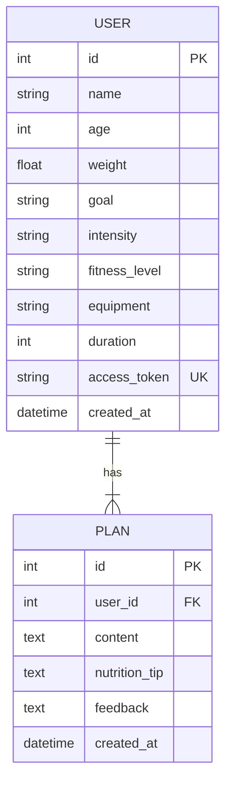

# 3. Project Design Phase

## Architecture
Modular FastAPI application: `main.py` owns startup/static files; `routes.py` owns form/JSON routes and authorization; `ai.py` owns Gemini prompts and provider failures; `database.py` owns engine/sessions; `models.py` defines profiles and plan versions. Jinja2 renders `index.html`, `result.html`, `nutrition.html` and `all_users.html` with shared navigation and responsive CSS.

## Entity design

The original plan has no feedback; later rows preserve the request that caused the revision. Plans are ordered by ID. SQLAlchemy sessions commit only after AI generation succeeds.

## Interface design
- Home: profile form and explanation of the three-step workflow.
- Result: latest workout, tip, feedback form and expandable history.
- Nutrition: goal selector with one concise tip.
- Coach: profile summaries with expandable original and updated plans.

## Problem–solution fit
| User problem | Proposed solution | Evidence to collect |
| --- | --- | --- |
| No clear weekly routine | Goal/profile-based seven-day Gemini prompt | Review a live generated plan for all seven days |
| Routine stops fitting preferences | Feedback revision with preserved original | Demonstrate cardio/rest-day revision and history |
| Training lacks recovery/diet context | Independent nutrition/recovery tip | Verify relevance for multiple goals |
| Coach cannot review changes | Authenticated profile and plan dashboard | Compare original and updated plans |

## Access and data design
Random 32-byte tokens replace public sequential user lookup. Plan URLs are bearer access links; owners must keep them private. Coach dashboard uses HTTP Basic authentication against environment settings and must be hosted on HTTPS. Missing credentials disable coach access. Jinja2 escapes generated text; private HTML responses use no-store and no-referrer. No external assets are required.

The implementation follows the reference's scenarios and modular structure. Model versions are configurable current Gemini models instead of copying legacy 1.5 examples. Names are excluded from prompts. Additional experience/equipment/duration fields preserve useful capabilities from the previous prototype.
